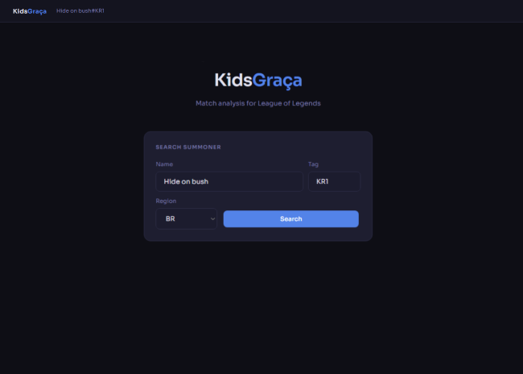
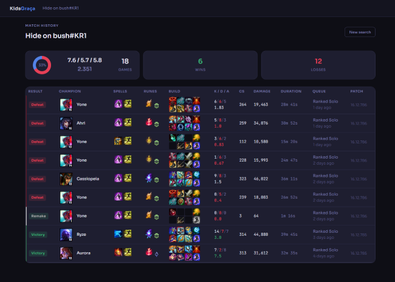
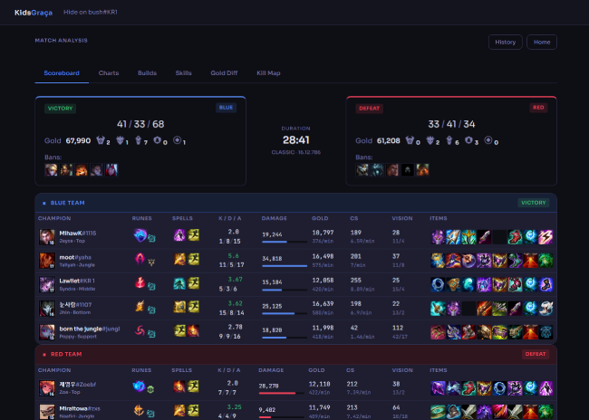
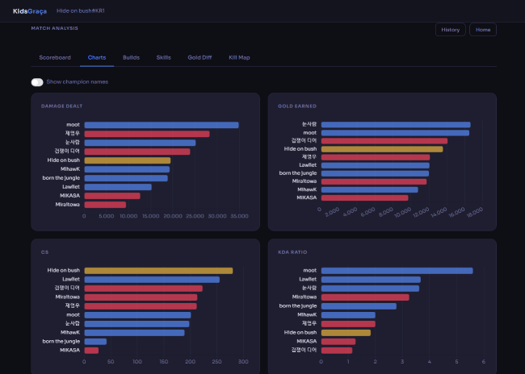
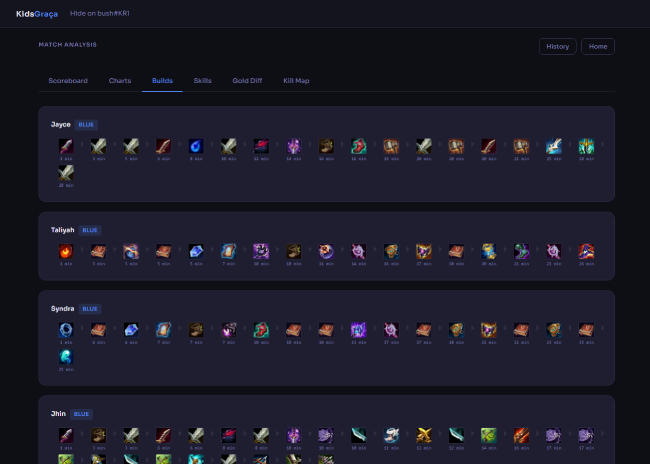
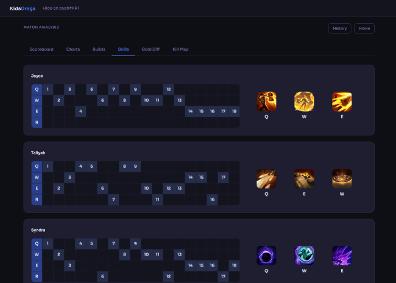
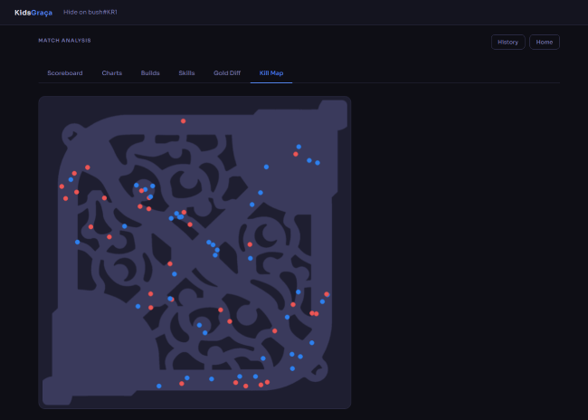

# KidsGraça Match Analysis

## Project Overview

This project is a data engineering and analytics application built with **Python (Flask)** and a **JavaScript frontend**, designed to explore real-world API integration and game data analysis using the Riot Games API.

The goal is to demonstrate end-to-end skills in **data acquisition, processing, analysis, and visualization**, by transforming raw League of Legends match data into structured datasets and interactive insights.

---

## Key Objectives

- Integrate and consume a complex REST API (Riot Games API)
- Process and normalize large-scale JSON game data
- Build reusable data pipelines using Python
- Perform exploratory data analysis (EDA) using pandas
- Implement caching to optimize API performance
- Visualize insights using Chart.js in a web dashboard

---

## Core Features

### Match History System

- Supports all Riot regions
- Handles both standard summoner names and Riot ID format (name + tag)
- Parallelized API requests for improved data retrieval performance
- File-based caching layer to reduce redundant API calls and improve responsiveness
- Infinite scroll interface with dynamically updated aggregated statistics

---

### Match Analytics Engine

- Team performance comparison (Blue vs Red side)
- Time-series analysis of key metrics:
  - Gold accumulation
  - Experience (XP)
  - Creep score (CS)
  - Damage output
- Objective control tracking
- Player performance analysis
- Role-based breakdown:
  - Top, Jungle, Mid, ADC, Support
- Item, rune, and summoner spell usage analysis per role

---

### Interactive Analytics Dashboard

- Advanced filtering by champion, player, and role
- Dynamic charts and heatmaps powered by Chart.js
- Full item build timeline visualization per match
- Minute-by-minute gold differential tracking
- Kill map visualization for spatial match analysis

---

## Focus Areas

This project emphasizes:

- Clean and modular architecture for API-driven applications
- Efficient data processing with Python and pandas
- Scalable API handling with parallel requests and caching
- Clear and interactive data visualization design
- Transforming raw JSON match data into actionable insights

# Setup
## 1. Get your API Key:
   Create an account in:
   
   https://developer.riotgames.com

> Important: The API key resets every 24 hours.

## 2. Configure environment:
   
   Create `.env`:
```env
APY_KEY=your_api_key
SECRET_KEY=your_flask_secret_key
#optional(preload your summoner name)
SUMMONER=your-summoner_name
TAG=your_tag #(without hashtag)
```
 ## Rate Limits
 - 20 requests every 1 seconds(s)
 
 - 100 requests every 2 minutes(s)
 ----
# UI Overview

<table>
  <tr>
    <td align="center" width="470"><b>Search Screen</b></td>
    <td align="center" width="470"><b>History Page</b></td>
  </tr>
</table>
<p align="center">
   
   
</p>

<table>
  <tr>
    <td align="center" width="470"><b>Match Dashboard</b></td>
    <td align="center" width="470"><b>Interactive Charts</b></td>
  </tr>
</table>
<p align="center">
   
   
</p>
<table>
  <tr>
    <td align="center" width="470"><b>Items Timeline</b></td>
    <td align="center" width="470"><b>Skill Leveling</b></td>
  </tr>
</table>
<p align="center">
   
   
</p>
<table>
  <tr>
    <td align="center" width="470"><b>Gold Diff by Minute</b></td>
    <td align="center" width="470"><b>Kill Map</b></td>
  </tr>
</table>
<p align="center">
   
   
</p>
